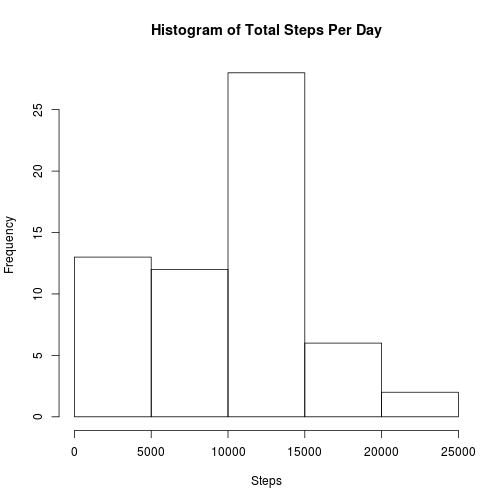
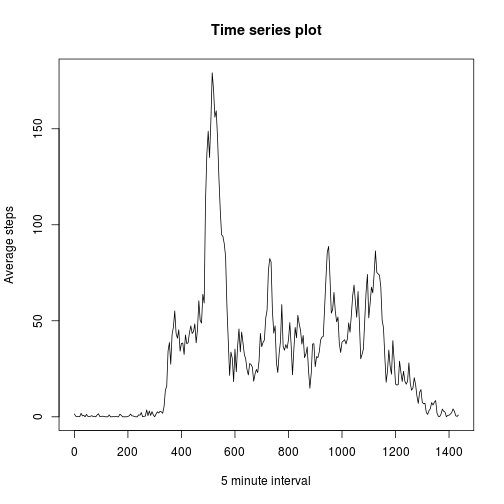
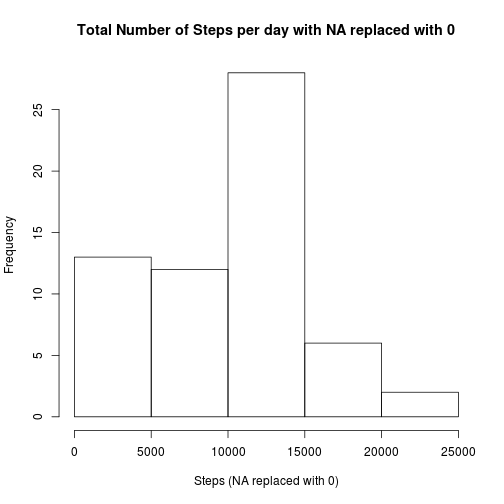
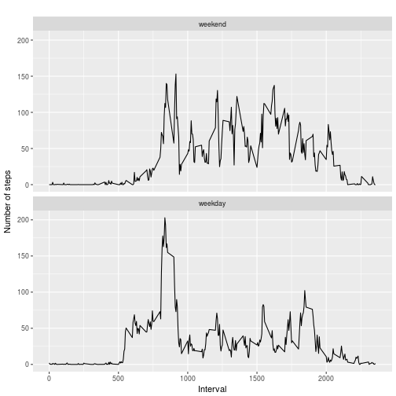

<!-- rmarkdown v1 -->

# Project 1 - Reproducible Research

## Loading and preprocessing the data

Load the data:


```r
raw_activity <- read.csv(
        "activity.csv",
        header = TRUE, 
        na.strings = "NA", 
        stringsAsFactors = FALSE, 
        colClasses = c("numeric", "character","numeric")
        )
```

```
## Warning in file(file, "rt"): cannot open file 'activity.csv': No such file
## or directory
```

```
## Error in file(file, "rt"): cannot open the connection
```

We need to understand what type of data we are dealing with and in
which structure. For that we use:


```r
str(raw_activity)
```

```
## 'data.frame':	17568 obs. of  4 variables:
##  $ steps   : num  0 0 0 0 0 0 0 0 0 0 ...
##  $ date    : chr  "2012-10-01" "2012-10-01" "2012-10-01" "2012-10-01" ...
##  $ interval: num  0 5 10 15 20 25 30 35 40 45 ...
##  $ dayofw  : Factor w/ 2 levels "weekend","weekday": 2 2 2 2 2 2 2 2 2 2 ...
```

```r
summary(raw_activity)
```

```
##      steps            date              interval          dayofw     
##  Min.   :  0.00   Length:17568       Min.   :   0.0   weekend: 4608  
##  1st Qu.:  0.00   Class :character   1st Qu.: 588.8   weekday:12960  
##  Median :  0.00   Mode  :character   Median :1177.5                  
##  Mean   : 32.48                      Mean   :1177.5                  
##  3rd Qu.:  0.00                      3rd Qu.:1766.2                  
##  Max.   :806.00                      Max.   :2355.0
```

Process/transform the data into a format suitable for analysis:


```r
library(lubridate)
activity <- data.frame(steps = raw_activity$steps, 
                       date = ymd(raw_activity$date), 
                       interval = raw_activity$interval)
```


## What is the mean total number of steps taken per day?

For this part of the assignment, you can ignore the missing values in the dataset.

1. Calculate the total number of steps taken per day

```r
total_steps_per_day <- tapply(activity$steps, activity$date, sum) 
print(total_steps_per_day)
```

```
## 2012-10-01 2012-10-02 2012-10-03 2012-10-04 2012-10-05 2012-10-06 
##          0        126      11352      12116      13294      15420 
## 2012-10-07 2012-10-08 2012-10-09 2012-10-10 2012-10-11 2012-10-12 
##      11015          0      12811       9900      10304      17382 
## 2012-10-13 2012-10-14 2012-10-15 2012-10-16 2012-10-17 2012-10-18 
##      12426      15098      10139      15084      13452      10056 
## 2012-10-19 2012-10-20 2012-10-21 2012-10-22 2012-10-23 2012-10-24 
##      11829      10395       8821      13460       8918       8355 
## 2012-10-25 2012-10-26 2012-10-27 2012-10-28 2012-10-29 2012-10-30 
##       2492       6778      10119      11458       5018       9819 
## 2012-10-31 2012-11-01 2012-11-02 2012-11-03 2012-11-04 2012-11-05 
##      15414          0      10600      10571          0      10439 
## 2012-11-06 2012-11-07 2012-11-08 2012-11-09 2012-11-10 2012-11-11 
##       8334      12883       3219          0          0      12608 
## 2012-11-12 2012-11-13 2012-11-14 2012-11-15 2012-11-16 2012-11-17 
##      10765       7336          0         41       5441      14339 
## 2012-11-18 2012-11-19 2012-11-20 2012-11-21 2012-11-22 2012-11-23 
##      15110       8841       4472      12787      20427      21194 
## 2012-11-24 2012-11-25 2012-11-26 2012-11-27 2012-11-28 2012-11-29 
##      14478      11834      11162      13646      10183       7047 
## 2012-11-30 
##          0
```
2. If you do not understand the difference between a histogram and a barplot, research the difference between them. Make a histogram of the total number of steps taken each day


```r
hist(total_steps_per_day, xlab="Steps", main="Histogram of Total Steps Per Day")
```



3. Calculate and report the mean and median of the total number of steps taken per day


```r
mean_before <- mean(total_steps_per_day, na.rm = TRUE)
print(mean_before)
```

```
## [1] 9354.23
```

```r
median_before <- median(total_steps_per_day, na.rm = TRUE)
print(median_before)
```

```
## [1] 10395
```

**The mean is 10766.19, the median is  10765**

***

## What is the average daily activity pattern?

1. Make a time series plot (i.e. type = "l") of the 5-minute interval (x-axis) and the average number of steps taken, averaged across all days (y-axis)

Change the units of the interval from hours and minutes to minutes only. 

```r
activity_without_na <- activity[!is.na(activity$steps),]

activity_without_na$interval_min <- sapply(
          activity_without_na$interval, 
          function(x){
            x1 <- as.numeric(x)
            out <- if( x1 != 0 & x1/100 >= 1 ){
                    ((x1%/%100)*60)+(x1%%100)
                  } else x1 
            out
          })
```

Calculate the average steps across all days.


```r
average_steps <- tapply(
  activity_without_na$steps, 
  activity_without_na$interval_min, 
  mean)
plot(y = average_steps, x=names(average_steps),type="l", xlab="5 minute interval", ylab="Average steps", main="Time series plot")
```




2. Which 5-minute interval, on average across all the days in the dataset, contains the maximum number of steps?

Find the maximum number of setps:

```r
max_avg_step <-max(average_steps)
print(max_avg_step)
```

```
## [1] 179.1311
```

Then find the label that matches that value, and transform it back to hours and minutes. Remember that the interval was originally given in hours and minutes but it was chnage to minutes only.

```r
max_in_min <- as.numeric(names(which(average_steps==max_avg_step)))
max_hours <- (max_in_min%/%60)
max_min <- (max_in_min%%60)
print(paste(max_hours, max_min, sep = ""))
```

```
## [1] "835"
```

**The maximum number of steps is 206.1698, which matches to the 835 interval.**

***

## Imputing missing values

Note that there are a number of days/intervals where there are missing values (coded as NA). The presence of missing days may introduce bias into some calculations or summaries of the data.

1. Calculate and report the total number of missing values in the dataset (i.e. the total number of rows with NAs)


```r
all_rows_with_na <- raw_activity[is.na(raw_activity),]
print(nrow(all_rows_with_na))
```

```
## [1] 0
```

**The total number of missing values is 2304**

2. Devise a strategy for filling in all of the missing values in the dataset. The strategy does not need to be sophisticated. For example, you could use the mean/median for that day, or the mean for that 5-minute interval, etc.

**Since we don't know what the potential values are for recorded NA, I am going to make them all 0.**


3. Create a new dataset that is equal to the original dataset but with the missing data filled in.


```r
raw_activity$steps[is.na(raw_activity$steps)] <- 0
head(raw_activity)
```

```
##   steps       date interval  dayofw
## 1     0 2012-10-01        0 weekday
## 2     0 2012-10-01        5 weekday
## 3     0 2012-10-01       10 weekday
## 4     0 2012-10-01       15 weekday
## 5     0 2012-10-01       20 weekday
## 6     0 2012-10-01       25 weekday
```


4. Make a histogram of the total number of steps taken each day and Calculate and report the mean and median total number of steps taken per day. Do these values differ from the estimates from the first part of the assignment? What is the impact of imputing missing data on the estimates of the total daily number of steps?


```r
total_steps_per_day_with0 <-tapply(raw_activity$steps, raw_activity$date, sum) 
print(total_steps_per_day_with0)
```

```
## 2012-10-01 2012-10-02 2012-10-03 2012-10-04 2012-10-05 2012-10-06 
##          0        126      11352      12116      13294      15420 
## 2012-10-07 2012-10-08 2012-10-09 2012-10-10 2012-10-11 2012-10-12 
##      11015          0      12811       9900      10304      17382 
## 2012-10-13 2012-10-14 2012-10-15 2012-10-16 2012-10-17 2012-10-18 
##      12426      15098      10139      15084      13452      10056 
## 2012-10-19 2012-10-20 2012-10-21 2012-10-22 2012-10-23 2012-10-24 
##      11829      10395       8821      13460       8918       8355 
## 2012-10-25 2012-10-26 2012-10-27 2012-10-28 2012-10-29 2012-10-30 
##       2492       6778      10119      11458       5018       9819 
## 2012-10-31 2012-11-01 2012-11-02 2012-11-03 2012-11-04 2012-11-05 
##      15414          0      10600      10571          0      10439 
## 2012-11-06 2012-11-07 2012-11-08 2012-11-09 2012-11-10 2012-11-11 
##       8334      12883       3219          0          0      12608 
## 2012-11-12 2012-11-13 2012-11-14 2012-11-15 2012-11-16 2012-11-17 
##      10765       7336          0         41       5441      14339 
## 2012-11-18 2012-11-19 2012-11-20 2012-11-21 2012-11-22 2012-11-23 
##      15110       8841       4472      12787      20427      21194 
## 2012-11-24 2012-11-25 2012-11-26 2012-11-27 2012-11-28 2012-11-29 
##      14478      11834      11162      13646      10183       7047 
## 2012-11-30 
##          0
```

```r
hist(total_steps_per_day_with0, 
     xlab="Steps (NA replaced with 0)",
     main="Total Number of Steps per day with NA replaced with 0")
```



**The histogram shows that the number of days with 0 steps increased.**

The mean and the median changed:  
The mean with NA replaced with 0:

```r
mean_after <- mean(total_steps_per_day_with0)
print(mean_after)
```

```
## [1] 9354.23
```

The difference:

```r
mean_after-mean_before
```

```
## [1] 0
```

The median with NA replaced with 0:

```r
median_after <- median(total_steps_per_day_with0)
```

The difference:

```r
median_after-median_before
```

```
## [1] 0
```

**The values shows that replacing NAs with 0 (zero), reduces the mean and median.**

***

## Are there differences in activity patterns between weekdays and weekends?

For this part the weekdays() function may be of some help here. Use the dataset with the filled-in missing values for this part.

1. Create a new factor variable in the dataset with two levels -- "weekday" and "weekend" indicating whether a given date is a weekday or weekend day.

```r
weekdays1 <- c('Monday', 'Tuesday', 'Wednesday', 'Thursday', 'Friday')

raw_activity$dayofw <- factor(
            (weekdays(ymd(raw_activity$date)) %in% weekdays1),
            levels=c(FALSE, TRUE), 
            labels=c('weekend', 'weekday') 
            )
```

2. Make a panel plot containing a time series plot (i.e. type = "l") of the 5-minute interval (x-axis) and the average number of steps taken, averaged across all weekday days or weekend days (y-axis). 


```r
avg_per_day_type <- aggregate(steps ~ interval + dayofw, raw_activity, mean)

library(ggplot2)
qplot(interval, 
      steps, 
      data=avg_per_day_type, 
      geom=c("line"),
      xlab = "Interval", 
      ylab = "Number of steps", 
      main = "") +
      facet_wrap(~ dayofw, ncol = 1)
```


